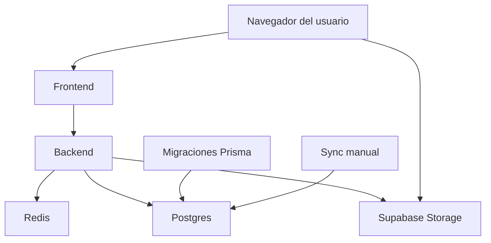

# Infraestructura del proyecto

Este repositorio contiene la infraestructura mínima para desplegar la aplicación con Docker Compose. La pila incluye un frontend, un backend, Redis y dos servicios auxiliares para migraciones y sincronización de datos.

## Arquitectura

Los contenedores definidos en este repositorio son:

- `db`: PostgreSQL oficial, expuesto en el puerto `5432`.
- `frontend`: expone la interfaz web en el puerto `80`.
- `backend`: expone la API en el puerto `3000`.
- `redis`: almacena caché y estado temporal, con persistencia en un volumen local.
- `migrate`: ejecuta migraciones Prisma antes de levantar el backend.
- `sync`: servicio manual para tareas de sincronización en producción.



## Requisitos

- Docker con Docker Compose v2.
- Acceso a las imágenes publicadas en GitHub Container Registry.
- Un archivo `.env` válido en la raíz del repositorio, copiado desde `.env.example`.

## Despliegue

1. Copia el archivo de ejemplo y ajusta los valores reales:

   ```bash
   cp .env.example .env
   ```

2. Verifica que el script tenga permisos de ejecución:

   ```bash
   chmod +x deploy.sh
   ```

3. Lanza el despliegue:

   ```bash
   ./deploy.sh deploy
   ```

El script comprueba que existan `.env` y `docker-compose.yaml`, levanta primero `db` y `redis`, ejecuta `migrate`, y solo si todo sale bien arranca `backend`.

## Sync manual

Si necesitas ejecutar la tarea de sincronización del backend tools, usa:

```bash
./deploy.sh sync
```

También puedes ejecutar sync durante el deploy:

```bash
./deploy.sh deploy --with-sync
```

## Variables de entorno

El archivo `.env.example` ya deja preparados los valores locales para:

- PostgreSQL estándar.
- Redis interno de Docker.
- Claves JWT/servicio/anon coherentes entre backend.
- La URL del frontend y la API del backend.
- La fuente y el destino del volumen del servicio `sync` mediante `SYNC_VOLUME_SOURCE` y `SYNC_VOLUME_TARGET`.

Antes de levantar el entorno, cambia obligatoriamente `SUPABASE_URL` y `SUPABASE_SERVICE_ROLE_KEY` por los valores de tu propio proyecto o instancia. No deben quedar los valores de ejemplo del repositorio. Esto se debe a que el sistema utiliza el servicio de Supabase Storage en la nube para quitar carga al sistema.

Para `sync`, cambia estas variables según el tipo de volumen que quieras usar:

- `SYNC_VOLUME_SOURCE="sync_data"` para usar un volumen nombrado de Docker, que es el valor por defecto.
- `SYNC_VOLUME_SOURCE="./sync-data"` para usar un bind mount desde el host.
- `SYNC_VOLUME_TARGET="/app/sync-data"` solo si quieres cambiar la ruta dentro del contenedor; normalmente no hace falta tocarla.

## Notas operativas

- Redis se ejecuta como servicio interno en Docker y usa un volumen llamado `redis_data`.
- PostgreSQL usa el volumen `db_data` para persistencia.
- Las migraciones fallan de forma explícita si el servicio `migrate` devuelve error; en ese caso el backend no se arranca.
- Si despliegas en un servidor remoto, ajusta `CORS_ORIGIN`, `API_URL` y `SUPABASE_URL` a la URL pública real, no a `localhost`.
