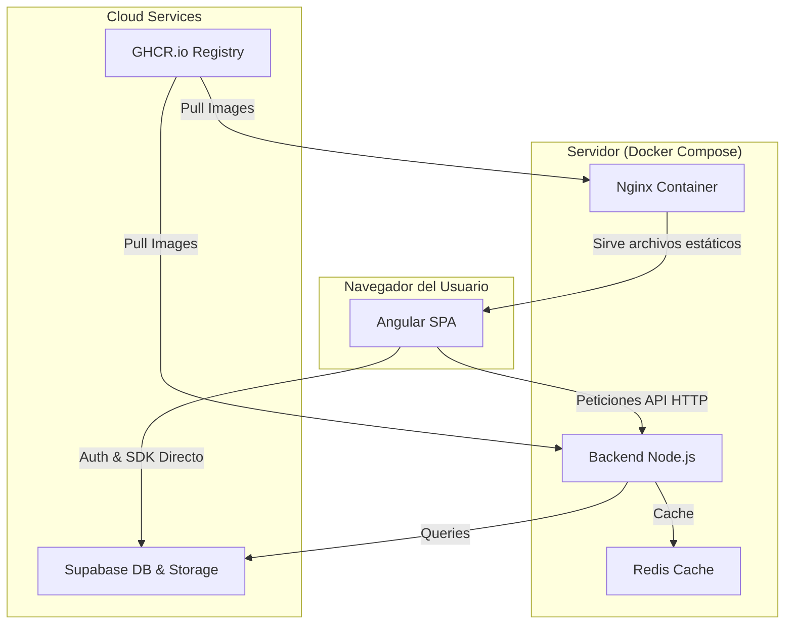

# 🚀 Infraestructura: Proyecto Software

Este repositorio contiene la configuración necesaria para desplegar el ecosistema completo de la aplicación utilizando **Docker Compose**. La arquitectura está diseñada para ser totalmente automatizada mediante **CI/CD** con GitHub Actions y **Supabase** como persistencia.

## 🏗️ Arquitectura del Sistema

El siguiente diagrama ilustra cómo interactúan los componentes. Es importante notar que el **Frontend (Angular)** se ejecuta en el navegador del cliente, no dentro de la red interna de Docker.



---

## 🛠️ Requisitos Previos

* **Docker** y **Docker Compose** instalado en el servidor.
* Acceso a las imágenes en **GitHub Container Registry (GHCR)**.
* Instancia de **Supabase** configurada.

---

## 🚀 Despliegue Rápido

1.  **Clonar este repositorio:**
    ```bash
    git clone https://github.com/tu-organizacion/deploy-proyecto-software.git
    cd deploy-proyecto-software
    ```

2.  **Configurar variables de entorno:**
    Crea un archivo `.env` basado en el ejemplo:
    ```bash
    cp .env.example .env
    nano .env
    ```

3.  **Lanzar el sistema:**
    ```bash
    docker compose pull # Descarga las últimas versiones de GHCR
    docker compose up -d
    ```

---

## 📋 Variables de Entorno (.env)

| Variable | Descripción |
| :--- | :--- |
| `DATABASE_URL` | URL de conexión de Supabase (PostgreSQL). |
| `REDIS_URL` | URL interna de Redis (`redis://redis:6379`). |
| `JWT_SECRET` | Clave para la firma de tokens en el backend. |
| `API_URL` | (Opcional) URL donde el frontend buscará el backend. |

---

## 🔄 Proceso de Actualización

Para desplegar cambios después de un `merge` en los repositorios de frontend o backend:

1.  GitHub Actions compilará y subirá las nuevas imágenes automáticamente.
2.  En el servidor, ejecuta:
    ```bash
    docker compose pull
    docker compose up -d
    ```
    *Docker detectará qué imágenes han cambiado y reiniciará solo los contenedores necesarios.*

---

## 💡 Notas sobre el Frontend (Angular)

Como el frontend es una **Single Page Application (SPA)**:
* El contenedor de Nginx solo sirve los archivos `.js` y `.html`.
* **No tiene acceso a la red interna de Docker** desde el navegador del usuario. 
* Asegúrate de que el `API_URL` en el frontend apunte a la IP pública o dominio del servidor, no a `localhost`.
