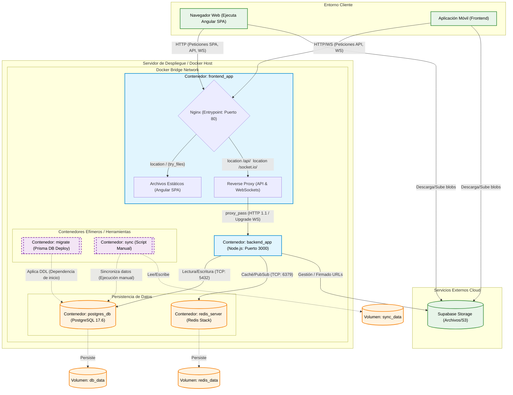

# Infraestructura del proyecto

Este repositorio contiene la infraestructura mínima para desplegar la aplicación con Docker Compose. La pila incluye un frontend, un backend, Redis y dos servicios auxiliares para migraciones y sincronización de datos.

## Arquitectura

El despliegue del sistema se realiza mediante Docker Compose, aislando los servicios en una red virtual interna y utilizando contenedores tanto persistentes (*always-on*) como efímeros (*one-shot*). Los contenedores definidos en este repositorio son:

* **`frontend`** (Nginx): Actúa como único punto de entrada público (puerto `80`). Cumple un doble rol:
1. Servidor de archivos estáticos para la aplicación web (Angular SPA) con políticas de caché y seguridad estrictas.
2. *Reverse proxy* que enruta de forma transparente las llamadas `/api/` y el tráfico de WebSockets (`/socket.io/`) hacia el contenedor del backend.


* **`backend`**: Servidor de aplicación (Node.js) expuesto en el puerto `3000`. Contiene la lógica de negocio, gestiona las conexiones WebSocket y actúa como intermediario seguro para el almacenamiento de archivos (Supabase Storage).
* **`db`**: Base de datos relacional PostgreSQL (v17.6). Por seguridad, **no expone puertos al host externo**, operando únicamente en la red interna de Docker. Su estado se persiste de forma segura en el volumen de Docker `db_data`.
* **`redis`**: Instancia de Redis Stack Server utilizada para almacenamiento de caché, gestión de estado en memoria y soporte Pub/Sub para WebSockets. Al igual que la base de datos, opera de forma aislada en la red interna con persistencia en el volumen `redis_data`.
* **`migrate`**: Contenedor efímero (*one-shot*) de la imagen de herramientas. Se encarga de aplicar automáticamente las migraciones DDL de Prisma en la base de datos (`db`) antes de que el backend inicie, garantizando la consistencia del esquema. Finaliza su ejecución tras completar su tarea.
* **`sync`**: Servicio bajo demanda (*one-shot*) destinado a tareas de sincronización de datos en producción. Está aislado bajo el perfil `manual`, por lo que no se levanta por defecto, y gestiona el mapeo de archivos mediante el volumen `sync_data`.

> **Nota sobre dependencias externas:** El almacenamiento y distribución de archivos multimedia (blobs/archivos de usuario) no se realiza en este servidor, sino que se delega al servicio cloud **Supabase Storage**.


```mermaid
graph TD
    %% --- ENTORNOS EXTERNOS ---
    subgraph Clients [Entorno Cliente]
        Browser["Navegador Web (Ejecuta Angular SPA)"]
        MobileApp["Aplicación Móvil (Frontend)"]
    end

    subgraph Cloud [Servicios Externos Cloud]
        Supabase[("Supabase Storage (Archivos/S3)")]
    end

    %% --- SERVIDOR DE DESPLIEGUE ---
    subgraph Server [Servidor de Despliegue / Docker Host]
        
        subgraph DockerNetwork [Docker Bridge Network]
            
            subgraph FrontendContainer [Contenedor: frontend_app]
                Nginx{"Nginx (Entrypoint: Puerto 80)"}
                StaticFiles["Archivos Estáticos (Angular SPA)"]
                ReverseProxy["Reverse Proxy (API & WebSockets)"]
            end

            BackendContainer["Contenedor: backend_app (Node.js: Puerto 3000)"]

            subgraph Persistence [Persistencia de Datos]
                DB[("Contenedor: postgres_db (PostgreSQL 17.6)")]
                Redis[("Contenedor: redis_server (Redis Stack)")]
            end

            subgraph Tools [Contenedores Efímeros / Herramientas]
                Migraciones[["Contenedor: migrate (Prisma DB Deploy)"]]
                Sync[["Contenedor: sync (Script Manual)"]]
            end
        end
    end

    %% --- RELACIONES Y FLUJOS DE RED ---

    %% Clientes a Nginx (Punto de entrada único)
    Browser -- "HTTP (Peticiones SPA, API, WS)" --> Nginx
    MobileApp -- "HTTP/WS (Peticiones API, WS)" --> Nginx

    %% Enrutamiento interno de Nginx (basado en tu archivo .conf)
    Nginx -- "location /  (try_files)" --> StaticFiles
    Nginx -- "location /api/  location /socket.io/" --> ReverseProxy

    %% Del Proxy al Backend
    ReverseProxy -- "proxy_pass (HTTP 1.1 / Upgrade WS)" --> BackendContainer

    %% Del Backend a las Bases de Datos
    BackendContainer -- "Lectura/Escritura (TCP: 5432)" --> DB
    BackendContainer -- "Caché/PubSub (TCP: 6379)" --> Redis

    %% Interacciones con Supabase
    BackendContainer -- "Gestión / Firmado URLs" --> Supabase
    Browser -- "Descarga/Sube blobs" --> Supabase
    MobileApp -- "Descarga/Sube blobs" --> Supabase

    %% Herramientas de Base de Datos (Líneas punteadas indican procesos bajo demanda)
    Migraciones -. "Aplica DDL (Dependencia de inicio)" .-> DB
    Sync -. "Sincroniza datos (Ejecución manual)" .-> DB
    Sync -. "Lee/Escribe" .-> VolumenSync[("Volumen: sync_data")]
    DB -. "Persiste" .-> VolumenDB[("Volumen: db_data")]
    Redis -. "Persiste" .-> VolumenRedis[("Volumen: redis_data")]

    classDef container fill:#e1f5fe,stroke:#0288d1,stroke-width:2px,color:#000;
    classDef database fill:#fff3e0,stroke:#f57c00,stroke-width:2px,color:#000;
    classDef ephemeral fill:#f3e5f5,stroke:#7b1fa2,stroke-width:2px,stroke-dasharray: 5 5,color:#000;
    classDef external fill:#e8f5e9,stroke:#388e3c,stroke-width:2px,color:#000;
    
    class FrontendContainer,BackendContainer container;
    class DB,Redis,VolumenDB,VolumenRedis,VolumenSync database;
    class Migraciones,Sync ephemeral;
    class Supabase,Browser,MobileApp external;
```

## Requisitos

- Docker con Docker Compose v2.
- Acceso a las imágenes publicadas en GitHub Container Registry.
- Un archivo `.env` válido en la raíz del repositorio, copiado desde `.env.example`.

## Despliegue

1. Copia el archivo de ejemplo y ajusta los valores reales:

   ```bash
   cp .env.example .env
   ```

2. Verifica que el script tenga permisos de ejecución:

   ```bash
   chmod +x deploy.sh
   ```

3. Lanza el despliegue:

   ```bash
   ./deploy.sh deploy
   ```

El script comprueba que existan `.env` y `docker-compose.yaml`, levanta primero `db` y `redis`, ejecuta `migrate`, y solo si todo sale bien arranca `backend`.

## Sync manual

Si necesitas ejecutar la tarea de sincronización del backend tools, usa:

```bash
./deploy.sh sync
```

También puedes ejecutar sync durante el deploy:

```bash
./deploy.sh deploy --with-sync
```

## Variables de entorno

El archivo `.env.example` ya deja preparados los valores locales para:

- PostgreSQL estándar.
- Redis interno de Docker.
- Claves JWT/servicio/anon coherentes entre backend.
- La URL del frontend y la API del backend.
- La fuente y el destino del volumen del servicio `sync` mediante `SYNC_VOLUME_SOURCE` y `SYNC_VOLUME_TARGET`.

Antes de levantar el entorno, cambia obligatoriamente `SUPABASE_URL` y `SUPABASE_SERVICE_ROLE_KEY` por los valores de tu propio proyecto o instancia. No deben quedar los valores de ejemplo del repositorio. Esto se debe a que el sistema utiliza el servicio de Supabase Storage en la nube para quitar carga al sistema.

Para `sync`, cambia estas variables según el tipo de volumen que quieras usar:

- `SYNC_VOLUME_SOURCE="sync_data"` para usar un volumen nombrado de Docker, que es el valor por defecto.
- `SYNC_VOLUME_SOURCE="./sync-data"` para usar un bind mount desde el host.
- `SYNC_VOLUME_TARGET="/app/sync-data"` solo si quieres cambiar la ruta dentro del contenedor; normalmente no hace falta tocarla.

## Notas operativas

- Redis se ejecuta como servicio interno en Docker y usa un volumen llamado `redis_data`.
- PostgreSQL usa el volumen `db_data` para persistencia.
- Las migraciones fallan de forma explícita si el servicio `migrate` devuelve error; en ese caso el backend no se arranca.
- Si despliegas en un servidor remoto, ajusta `CORS_ORIGIN` y `SUPABASE_URL` a la URL pública real, no a `localhost`.
